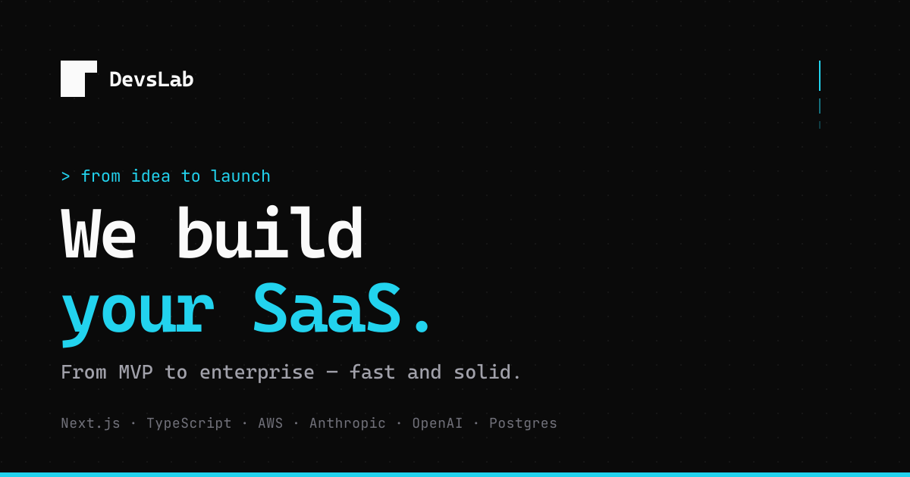

<div align="center">
  
</div>

<p align="center">
  <a href="https://devslab.kr">🌐 devslab.kr</a> ·
  <a href="mailto:support@devslab.kr?subject=DevsLab%20프로젝트%20문의">📬 support@devslab.kr</a> ·
  <a href="./README.md">🇺🇸 English</a>
</p>

---

```bash
$ npx create-saas @devslab/starter
→ 멀티테넌트 아키텍처 셋업...
→ 인증·결제·권한 구성...
→ 관측성 스택 연결...
→ AI 통합 레이어 준비...
✓ 견고한 SaaS 기반 완성
```

## `// who we are`

한국 기반의 작은 스튜디오. **아키텍처, 풀스택 · 모바일, AI 통합**을 한 팀에서.
유행 따라 흔들리지 않습니다. 운영 환경에서 증명된 것만 사용합니다.

MVP부터 엔터프라이즈까지, 첫 사용자를 만날 때까지 함께합니다.

## `// what we ship`

| `[01]` | **확장 가능한 설계** — 멀티테넌시 · 인증 · 결제 · 관측성 |
|--------|------------------------------------------------------------|
| `[02]` | **엔드투엔드 개발** — Next.js · Vue · Node · Spring Boot · Cloud Native |
| `[03]` | **AI 통합** — LLM · RAG · 에이전트 워크플로우 |
| `[04]` | **하이브리드 + 네이티브 모바일** — Ionic + Vue · Flutter · Jetpack Compose |
| `[05]` | **오픈소스 인프라** — 우리 SaaS에서 먼저 쓰고 커뮤니티와 공유 |

## `// stack we trust`

```
frontend  Next.js · React · Vue · HTMX · TypeScript · Tailwind
mobile    Ionic · Flutter · Capacitor · Kotlin · Jetpack Compose
backend   Node.js · Spring Boot · tRPC · Postgres · Redis · Drizzle
cloud     AWS · Vercel · Cloudflare · CloudType · Supabase
devops    Docker · Grafana · Prometheus · Sentry · Firebase
ai        Anthropic · OpenAI · LangChain · pgvector
```

## `// open source`

우리 SaaS에서 먼저 검증하고, 커뮤니티에 공유합니다.

- 🪶 **[easy-paging-spring-boot-starter](https://github.com/devslab-kr/easy-paging-spring-boot-starter)** — 페이징, 쉽게
- 🛡️ **[ssrf-guard](https://github.com/devslab-kr/ssrf-guard)** — Spring 기반 SSRF 차단
- 📜 **[api-log](https://github.com/devslab-kr/api-log)** — 이벤트 드리븐 API 로깅 (PostgreSQL JSONB)

## `// partners`

- **[XunyaTech](https://xunya.tech)** — 성장하는 기업을 위한 사이버보안 우선 관리형 IT

## `// say hi`

```bash
$ ./contact --send
```

- 📬 [support@devslab.kr](mailto:support@devslab.kr?subject=DevsLab%20프로젝트%20문의)
- 🌐 [devslab.kr](https://devslab.kr) — 14개 언어 지원

<sub>© DevsLab · Built in Seoul</sub>
